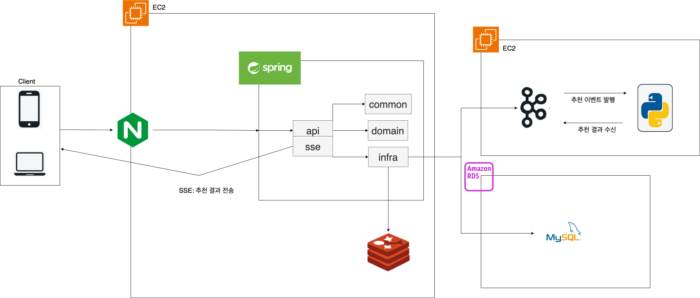

## 🧩 개요
기존 금융 서비스는 추천이 아니라 필터 검색 중심이라, 사용자가 ‘나에게 맞는 상품’을 찾기까지 많은 정보를 읽고 발품을 팔아 비교했어야 했습니다.

핀픽은 이 과정을 줄이기 위해 사용자가 설정한 프로필을 기반으로 **자동 추천** 구조를 설계했습니다.

## 🖼️ 아키텍처

## ⚙️ 기술 스택
- **Language**: Java 21
- **Framework**: Spring Boot 3.4.4, Spring for GraphQL
- **Build Tool**: Gradle (Multi-module)
- **DataBase**: MySQL, Redis
- **Message Queue**: Kafka
- **Security**: OAuth2 (Kakao), JWT
- **Infra**: AWS EC2, Docker, GitHub Actions

## 📌 주요 기능 (작업 목록)
- 프로필
  - 생성, 조회, 수정, 색상변경, 순번 변경
- 대출 상품
  - 프로필 기반 대출 상품 추천, 이 상품을 본 사람들이 본 상품 기능, 조회

## 🧠 설계 철학 (DDD, 멀티모듈 등)
### 설계 원칙

- 도메인 로직은 외부 기술에 의존하지 않아야 한다 (Clean Architecture)
- 각 책임은 명확한 경계를 가져야 한다 (DDD)
- 테스트 가능한 구조를 우선시한다 (멀티모듈 + 계층 분리)

### 효과

- 기술 변화와 도메인 로직의 영향도를 분리 → 도메인부터 시작한 개발 프로세스로 비지니스 로직에 더욱 집중할 수 있는 환경, 유지보수 쉬움
- 도메인의 비지니스 로직의 집중 테스트가 가능 → 빠르고 안정적인 검증

### 모듈 구성

- `api`: 실행, GraphQL 설정, 인증 처리,
- `domain`: 도메인 모델(Aggregate), VO, Policy, 로직 처리
- `infra`: Kafka, Redis, JWT, JPA 등 기술 연동
- `common`: ExceptionHandler, Event, 유틸

핀픽은 아직 도메인 정책이 복잡하지 않았지만, 다양한 도메인(사용자 프로필, 추천 조건, 대출 상품, 추천 상품 등)이 유기적으로 연결되어야 했고, 앞으로 알림 같은 새로운 도메인이 추가, 새로운 기술을 적용하거나 정책이 변화할 가능성이 높다고 판단했습니다.

이에 따라 **확장성과 결합도 관리를 고려해 멀티모듈 구조를 도입**하였습니다. 그러나 멀티모듈로 구조를 나누기 시작하면서, 오히려 **레이어 간 의존성과 책임 분리에 대한 고민이 더 복잡해졌고**, 자연스럽게 도메인을 중심으로 한 경계 설정(Domain-Driven Design)이 필요하다는 흐름으로 이어졌습니다.

각 모듈이 느슨하게 연결되면서도 유기적으로 협력할 수 있도록 **도메인을 중심으로 구조를 정리하는 방향(DDD 기반)**으로 발전시켰습니다.

결과적으로, **도메인 모델과 외부 구현체를 명확히 분리하고**, 비즈니스 로직의 흐름을 도메인 내부에 집중시켜 **유지보수성과 이해가능성을 높이는 구조**를 설계하게 되었습니다.

## 🔧 사용 기술 및 이유 (Kafka, GraphQL, Redis, SSE)
### GraphQL – 유연한 사용자 맞춤형 응답을 위해

- 핀픽은 사용자의 직업, 고용형태, 성별, 나이 등 다양한 조건에 따라 추천 결과의 형태가 달라지는 구조였습니다.
- 기존 REST 방식에서는 이러한 **필드 유동성**을 유연하게 처리하기 어려웠기 때문에,
- 클라이언트가 필요한 데이터만 선택적으로 가져갈 수 있는 **GraphQL을 채택**했습니다.
- 또한, 추천이 완료된 이후에만 특정 데이터가 노출되어야 하는 등 **상태 기반 조건 응답**에 적합하다는 점도 선택의 이유였습니다.

---

### Kafka – 비동기 처리 및 시스템 분리

- 대출 추천 처리 과정은 사용자 요청과 동시에 DB 필터링, 추천 로직 실행, 외부 API 호출 등 **복잡하고 시간이 걸리는 작업**이 포함되어 있었습니다.
- 이를 API 동기 처리로 구성할 경우 사용자 대기 시간이 길어지고 서버 부하도 급격히 증가했습니다.
- 이에 따라, 사용자 요청은 Kafka에 메시지를 발행하고 추천은 **백그라운드에서 비동기로 수행**되도록 설계했습니다.
- 이로 인해 API 응답 속도가 감소하여 사용자가 바라보는 대기화면을 줄일 수 있었습니다. 또한, 처리 흐름도 명확히 분리되었습니다.

---

### Redis – 추천 결과 캐싱

- 추천 결과는 사용자별로 프로필을 변경하지 않는 이상 동일하고, 추천 결과가 메인페이지에 보여져 요청이 반복적으로 발생하기 때문에 결과를 Redis에 **TTL 기반 캐싱**하는 방식으로 전환했습니다.
- 이로 인해 추천 결과 **응답 속도를 개선**할 수 있었고, 제일 많이 사용되는 추천 상품의 조회의 **DB 조회를 줄여 DB의 부하도 줄었습니다.**
- Redis의 LRU 정책과 TTL을 병행 적용하여 **불필요한 메모리 점유를 최소화**할 수 있었습니다.

---

### SSE - 추천 결과 전달

- 비동기로 추천 상품이 만들어지다보니 만들어진 결과를 클라이언트에게 전달할 수단이 필요했습니다.
- 소켓과 SSE의 선택지가 있었지만, 서버만 클라이언트에게 전달하면 되는 상황이기에 양방향인 소켓보다 단방향인 SSE를 선택하였습니다.
- 추천 결과는 Kafka 기반 비동기 이벤트 처리 후 생성되기 때문에,
- 클라이언트에 결과를 전달하는 수단이 필요했습니다.
- 양방향 통신이 필요한 WebSocket보다, 단방향이고 서버 주도 알림에 적합한 SSE를 선택했습니다.

## 작업 목록
EPIC: LS-0
Features
- feature/FP-1: 카카오 회원가입, 로그인에 사용되는 인가, 인증 시스템 구현
- feature/FP-2: CI 관련 스크립트, 린트
- feature/FP-3: 유저 회원가입 기능
- feature/FP-4: 글로벌 예외 처리
- feature/FP-5: 유저 토큰 처리
- feature/FP-6: 유저 프로필 기능
- feature/FP-7: Refresh토큰 기능
- feature/FP-8: 대출 상품 추천 기능
- feature/FP-9: Kafka 적용
- feature/FP-10: Multi Module로 프로젝트 구조 변경
- feature/FP-11: 이 상품을 본 유저들이 본 상품이에요 기능
- feature/FP-12: domain 모듈 테스트 코드 작성
- feature/FP-13: jacoco 적용
- feature/FP-14: Domain Module Test 추가
- feature/FP-15: gradle 의존성 관리
- feature/FP-16: 카프카 리트라이, DLQ 설정
- feature/FP-17: sse 리턴 변경
- feature/FP-18: 레디스 캐시 ttl 설정
- feature/FP-19: infra 하위 패키지 -> 모듈로 분리
- feature/FP-20: 1차 구조변경
- feature/FP-21: 프로파일 직업군 기획 추가로 인한 수정
- feature/FP-22: 대출 상품 기획 변경으로 인한 수정
- feature/FP-23: 카프카 consumer 책임 분리
- feature/FP-24: 도메인 테스트 코드 추가
- feature/FP-25: 도메인 모듈 나누기
- feature/FP-26: 추천 대출 상품 조회시 Slice 될 수 있도록 변경 및 대출 상품 Repository들을 한곳으로 이동
- feature/FP-27: 추천 대출 상품 Redis Cache 제거
